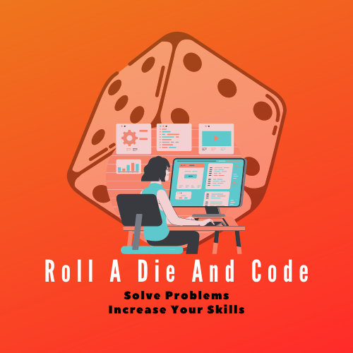
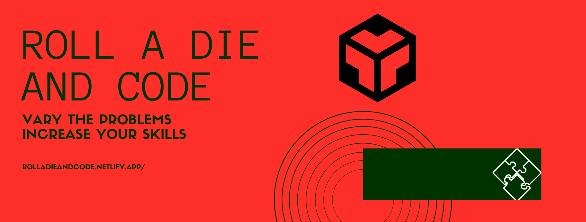

# Roll A Die And Code

<!--Badges here-->

Because I'm a big fan of problem solving and I am always looking for new problems and new platforms to increase my skills, I thought about putting an app to generate a platform so you can simply go there, click on a button and a random platform is generated for you!

After stumbling on a reddit post where the user Neu_Ron had initially fetched a great list of platforms and [shared it on reddit](https://www.reddit.com/r/learnprogramming/comments/c37o7k/a_list_of_all_problem_solving_websites/), I decided to make this app to randomize the platform choice. If you're like me, you like to try different platforms as each platform have their own way to present the problems, so this app can be a nice thing to have around.

Thank you in advance for [contributing](#contribute) to this list of coding-practice platforms so it stays updated!

# Table of contents

- [Project Title](#project-title)
- [Demo-Preview](#demo-preview)
- [Table of contents](#table-of-contents)
- [Installation](#installation)
- [Usage](#usage)
- [Contribute](#contribute)
- [License](#license)
- [Footer](#footer)

# Installation

Simply fork the repo, `cd` into it and run npm install.

# Usage

[Use it live](https://rolladieandcode.netlify.app/)

Or, locally, once you have installed, run `npm run start` from within the `roll-a-die-and-code` repo.

# Contribute

If you want to improve the list of platforms, or if you find that links are not maintained anymore, please refer to the [ongoing open issue](https://github.com/wolfthread/roll-a-die-and-code/issues/1).

You can, of course, also refer to the [open issues](https://github.com/wolfthread/roll-a-die-and-code/issues) to contribute!

# License

[MIT](LICENSE)

---

